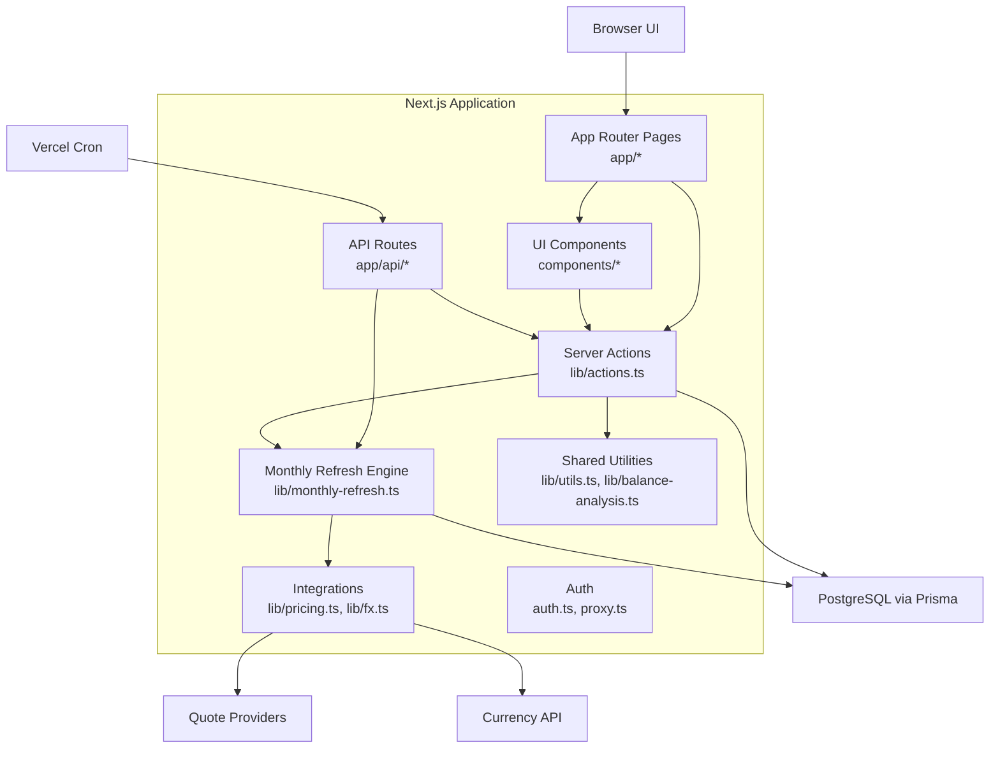
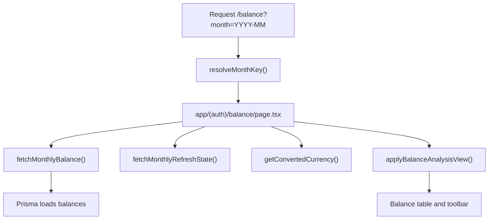
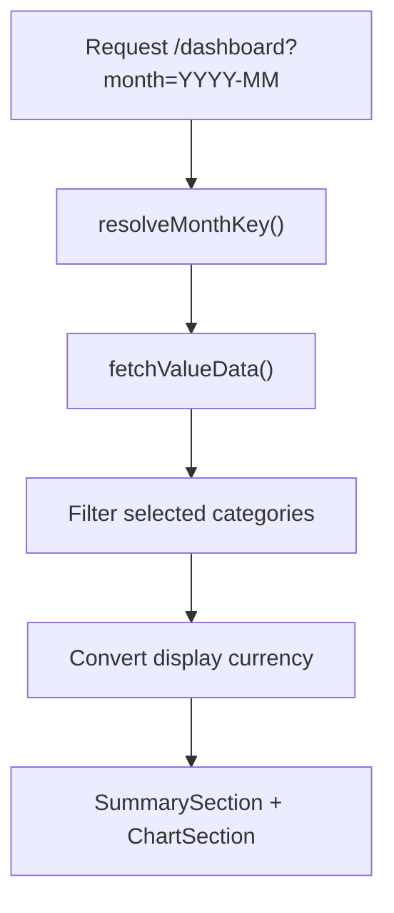
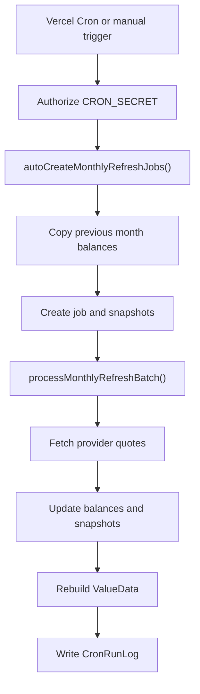

# Family Ledger Architecture Guide

## Purpose

This is the source of truth for Family Ledger architecture rules, module boundaries, and runtime flows. Use it when changing routing, server actions, data access, authentication, refresh workflows, imports, or shared abstractions.

## System Overview

Family Ledger is a monolithic Next.js application using:

- Next.js App Router for pages and API routes.
- React Server Components for server-rendered route composition.
- Client components for interactive forms, tables, filters, and navigation.
- NextAuth for credentials-based authentication.
- Prisma with PostgreSQL for persistence.
- Server actions in `lib/actions.ts` as the current application service layer.
- `lib/monthly-refresh.ts` as the dedicated monthly refresh workflow engine.
- External quote and FX providers through `lib/pricing.ts` and `lib/fx.ts`.

## Layer Responsibilities

### Presentation layer

Location: `app/*`, `components/*`

Responsibilities:

- Render route pages and UI components.
- Assemble server-loaded data into visible screens.
- Hold client-only interaction state where needed.
- Call server actions or API routes for mutations and server workflows.

Rules:

- UI must not import Prisma directly.
- Client components must not import server-only modules such as Prisma, quote providers, FX provider internals, API route internals, filesystem APIs, or auth internals.
- Components should prefer typed props and shared UI primitives over direct data-layer coupling.

### Application service layer

Location: currently `lib/actions.ts`

Responsibilities:

- Authenticated reads and mutations.
- Server action entrypoints for UI workflows.
- Revalidation and redirect behavior.
- Coordination with monthly refresh and value-data services.

Current constraint:

- `lib/actions.ts` is broad and should be split over time by business capability, not HTTP verb.

Target direction:

- `lib/balance/queries.ts`
- `lib/balance/commands.ts`
- `lib/dashboard/queries.ts`
- `lib/settings/queries.ts`
- `lib/settings/commands.ts`
- `lib/value-data/service.ts`

### Domain workflow layer

Location: `lib/monthly-refresh.ts`, `lib/balance-analysis.ts`

Responsibilities:

- Monthly refresh job lifecycle.
- Quote deduplication and provider batching.
- Retry and failure state.
- Balance analysis view filtering and percentages.

Rules:

- Keep the monthly refresh engine server-only.
- Do not move provider-specific rate limits or batch logic into UI components.
- Keep workflow state explicit in database-backed job/snapshot/log models.

### Integration layer

Location: `lib/pricing.ts`, `lib/fx.ts`, `auth.ts`

Responsibilities:

- External quote provider adapters.
- Currency conversion and rate caching.
- Credentials auth integration.

Rules:

- Provider secrets and provider calls stay server-side.
- Client UI should receive computed values or call narrow server actions.

### Persistence layer

Location: `prisma/schema.prisma`, `prisma/migrations/*`, `lib/prisma.ts`

Responsibilities:

- Database schema.
- Prisma client.
- Migrations and seed behavior.

Rules:

- Database safety rules are owned by `docs/data-model-guide.md` and `docs/testing-strategy.md`.
- Data semantics belong in `docs/data-model-guide.md`.

## Key Runtime Flows

### Balance page

Architecture note:

- The Balance page currently performs significant view-model assembly in the route file. Future refactors should extract read-model builders before adding more page-level shaping.

### Dashboard page

Architecture note:

- Dashboard reads should prefer `ValueData` instead of rebuilding chart totals from raw balances on every request.

### Monthly refresh

Rules:

- Cron route tests should exercise authorization and structured result behavior.
- Test harnesses for cron should use isolated test data or test-tagged rows.
- The real cron path should remain the source of truth for refresh behavior.

## Dependency And Abstraction Rules

- New dependencies require justification in the proposal or design.
- Shared abstractions require proven reuse or a clear local pattern.
- Avoid adding framework layers around small workflows until duplication or risk justifies them.
- Prefer custom scripts for small local boundary checks; adopt dependency-cruiser when import rules become broad enough to need graph tooling.

## Validation

Architecture rules are validated by:

- `npm run architecture:check`
- `npm run typecheck`
- `npm run lint`
- focused Vitest tests for changed behavior
- manual review for dependency and abstraction decisions

Any durable architecture rule added here must also be mapped in `docs/validation-harness.md`.
