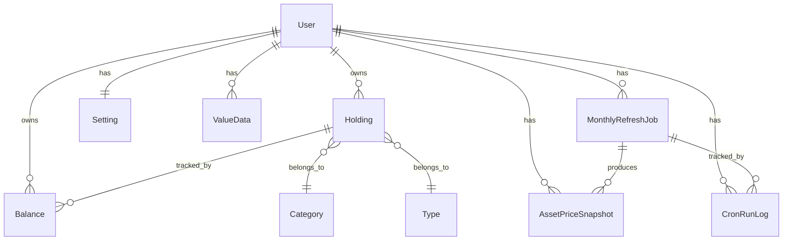

# Family Ledger Data Model Guide

## Purpose

This is the source of truth for Family Ledger data semantics. Use it when changing Prisma models, migrations, seed data, balance calculations, month handling, currency conversion, value aggregation, or refresh state.

## Core Model Groups

### Portfolio data

- `User`: account owner.
- `Holding`: asset or liability being tracked.
- `Category`: holding class such as cash, cryptocurrency, listed stock, or unlisted stock.
- `Type`: asset/liability grouping.
- `Balance`: monthly snapshot for one holding.

Rules:

- A balance row represents one holding for one month.
- Asset/liability meaning must come from type/category data, not color alone.
- Balance values should stay auditable through source, note, and status fields where available.

### Settings and read models

- `Setting`: user-level accounting month, display currency, display categories, and cron-test metadata.
- `ValueData`: precomputed monthly/category values for dashboard charts.
- `CurrencyExchangeRate`: cached FX rates by date and currency.

Rules:

- Dashboard chart reads should prefer `ValueData`.
- ValueData rebuilds must stay synchronized with balance creation, update, import, and refresh workflows.
- Display currency conversion should preserve the original balance currency fields.

### Refresh workflow data

- `MonthlyRefreshJob`: refresh lifecycle for one user/month.
- `AssetPriceSnapshot`: deduplicated provider/source/month quote state.
- `CronRunLog`: visible operational history for scheduled, manual-test, and manual-create runs.

Rules:

- Refresh jobs must be resumable and observable.
- Quote-backed copied rows start as estimated or pending until refreshed.
- Failed quote refreshes should keep enough state for retry and user-visible status.

## Month Semantics

Family Ledger is month-based, not timestamp-based.

Canonical month identity:

- URL/query identity: `YYYY-MM`
- Helper type: `MonthKey`
- Time zone: app-local month handling uses `APP_TIME_ZONE`, currently defaulting to `Asia/Taipei`.

Required helpers:

- `getMonthKey(date)`
- `resolveMonthKey({ month, date, fallback })`
- `monthKeyToDate(monthKey)`
- `addMonthsToMonthKey(monthKey, delta)`
- `getDatePartsInTimeZone(date, APP_TIME_ZONE)`

Rules:

- Do not compare month identity with raw timestamp equality.
- Do not introduce ad hoc `toISOString().slice(0, 7)` month logic in app behavior.
- Route state should use `month=YYYY-MM` where a user-visible month is selected.

## Money, Currency, And Precision

Rules:

- Keep original amount, currency, and date available when converting display values.
- Currency conversion should be keyed by date, source currency, and target currency.
- Financial values should render with `tabular-nums` where they appear in UI.
- Important finance calculations need focused tests.
- Do not silently round or truncate calculation inputs to make UI formatting easier.

Current constraint:

- Some page-level flows still convert each row independently. Future optimization should batch conversions by date/from/to currency.

## Value Source Semantics

Family Ledger must distinguish value confidence:

- Manual: entered or edited by a user.
- Imported: created through CSV/import workflow.
- Estimated: copied from prior month or waiting for quote refresh.
- Refreshed: updated from quote provider.
- Failed: attempted provider refresh but could not update.

Rules:

- Status must be visible in UI through text, labels, icons, or accessible names, not only color.
- Estimated values should remain clear until refresh completes.
- Failed values should remain retryable where the workflow supports retry.
- Manual corrections must not be overwritten without a deliberate workflow.

## Seed And Test Data

Rules:

- Do not delete or reset the real database as part of demo/test setup.
- Demo data must be additive and scoped.
- Automated tests should use isolated test schemas or isolated test-tagged data.
- Database-backed test reset helpers must verify they are running against a `family_ledger_test_` schema before deleting rows.
- Natural demo data should avoid fake-looking linear growth when the goal is realistic chart behavior.

## Validation

Data model rules are validated by:

- `npm run typecheck`
- `npm run test:unit`
- `npm run test` when database-backed behavior changes
- focused tests in `tests/balance-analysis.test.ts`
- focused tests in `tests/monthly-refresh*.test.ts`
- manual review for source semantics that are not yet enforced by shared APIs

Any durable data rule added here must also be mapped in `docs/validation-harness.md`.
