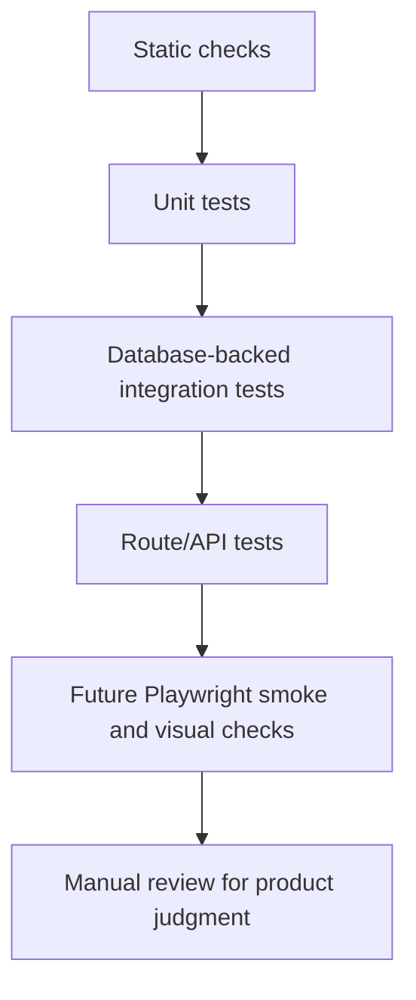

# Family Ledger Testing Strategy

## Purpose

This is the source of truth for Family Ledger testing expectations. Use it when adding behavior, changing finance calculations, changing data workflows, changing UI flows, or updating the validation harness.

## Testing Layers



## Current Commands

| Command | Purpose |
| --- | --- |
| `npm run typecheck` | TypeScript validation with `tsconfig.typecheck.json`. |
| `npm run lint` | ESLint validation with zero warnings allowed. |
| `npm run build` | Prisma client generation plus Next production build. |
| `npm run design:check` | High-signal design-system drift checks. |
| `npm run architecture:check` | Import-boundary checks for UI/server separation. |
| `npm run docs:check` | Source-doc and OpenSpec routing drift checks. |
| `npm run harness:check` | Combined Phase A harness. |
| `npm run test:unit` | Non-database Vitest tests only. |
| `npm run test` | Test runner that creates an isolated Prisma schema before Vitest. |

## Deployment Validation Sequence

For changes intended to ship through GitHub-to-Vercel deployment, testing continues past local commands:

```text
local validation
  -> commit and push to GitHub
  -> Vercel deployment completes
  -> deployed URL loads
  -> touched route or workflow passes a smoke check
  -> OpenSpec archive
```

Agents should run this sequence in agent-led gate mode. At each boundary that changes repository or deployment state, the agent reports the evidence from the completed step and asks the maintainer to confirm the next step. The maintainer can still choose to skip a gate, but the agent must warn which evidence will be missing and ask for explicit confirmation before continuing.

Use the smallest relevant local command set before pushing. For process and harness changes, that is `npm run docs:check` and `npm run harness:check`. For app behavior changes, use typecheck, lint, build, and focused tests; use `npm run test` for database-backed behavior when a Prisma-compatible isolated test database URL is available.

Direct `main` deployment is acceptable for small, low-risk fixes when the maintainer intentionally accepts production auto-deploy. CI/CD, deployment, environment variable, authentication, database behavior, migrations, production-like data workflows, and large user-visible UI changes should prefer a branch or Git worktree with Vercel Preview verification before merge, then production verification after merge.

Change tasks or notes should record local checks, Vercel deployment status, the preview or production URL smoke-checked, and any skipped checks or manual-only rules.

## What Requires Tests

Add or update focused tests when changing:

- money, currency, or percentage calculations
- month-key behavior
- balance analysis filtering
- monthly refresh job behavior
- cron route authorization or result shape
- value-data rebuild behavior
- import or seed behavior
- authentication or protected route behavior
- UI workflows that can regress without type errors

For existing UI workflow integration, tests or recorded manual evidence must prove the workflow end to end. Code inspection is not enough. At minimum, verify:

- the create or submit path writes the expected data
- the list, table, detail, or read path visibly shows the created data
- the relevant filters, tabs, or analysis views do not hide the created data unexpectedly

## TDD With OpenSpec

Family Ledger uses test-driven development inside the OpenSpec workflow. The goal is not to write a large test suite before implementation. The goal is one vertical behavior slice at a time: RED, GREEN, REFACTOR, then validation evidence.

```text
TDD in Family Ledger

OpenSpec requirement or Codex plan
        |
        v
Name ONE observable behavior
        |
        v
Name the public interface under test
        |
        v
RED
  write one failing behavior test
  run focused command
  record failure
        |
        v
GREEN
  implement the smallest passing change
  rerun focused command
  record pass
        |
        v
REFACTOR
  improve design only while GREEN
  rerun focused command
        |
        v
VALIDATE
  run final command set
  record skipped/manual checks
```

### Behavior Tests

Tests describe observable behavior through public interfaces. They should survive internal refactors. Avoid tests that assert private helper calls, implementation order, or internal collaborator wiring.

Good behavior-level shape:

```typescript
test("created Taiwan stock appears in the balance analysis read path", async () => {
  const holding = await createHolding(validTaiwanStockInput);

  const rows = await getBalanceAnalysisRows({ userId: holding.userId });

  expect(rows).toContainEqual(
    expect.objectContaining({
      symbol: "2330",
      exchange: "TWSE",
      holdingTypeName: "Assets",
    }),
  );
});
```

Bad implementation-detail shape:

```typescript
test("createHolding calls prisma.holding.create", async () => {
  const spy = vi.spyOn(prisma.holding, "create");

  await createHolding(validTaiwanStockInput);

  expect(spy).toHaveBeenCalled();
});
```

### Mocking Rules

Mock system boundaries only. Do not mock internal collaborators. Prefer isolated DB tests over Prisma mocks for persistence behavior.

Allowed boundary mocks:

```text
- quote provider API
- exchange-rate API
- time/date
- filesystem import input
- network failure response
- email/payment service if added later
```

Avoid mocks:

```text
- balance-analysis helper
- monthly-refresh internal function
- createHolding calling local service
- Prisma for persistence behavior
- server action calling another local module
```

Good boundary-mock shape:

```typescript
test("pricing marks quote provider failure without hiding existing holding", async () => {
  const quoteProvider = {
    getQuote: vi.fn().mockRejectedValue(new Error("provider unavailable")),
  };

  const result = await refreshHoldingPrice(holding, { quoteProvider });

  expect(result.status).toBe("failed");
  expect(result.holdingId).toBe(holding.id);
});
```

Bad internal-mock shape:

```typescript
test("monthly refresh calls updateHoldingPrice twice", async () => {
  const spy = vi.spyOn(refreshInternals, "updateHoldingPrice");

  await runMonthlyRefresh(userId);

  expect(spy).toHaveBeenCalledTimes(2);
});
```

### Interface Design For Testability

Accept dependencies instead of creating them internally. Return results instead of producing hidden side effects. Keep public interfaces small.

Good shape:

```typescript
const projection = calculateFireProjection(profile, assumptions);
```

Bad shape:

```typescript
applyFireProjectionMutation(globalState, userId, request, prisma, logger);
```

Family Ledger guidance:

```text
Calculation behavior:
  Prefer pure functions.

Server workflow behavior:
  Use one service/server-action entrypoint.

External provider behavior:
  Pass a typed provider dependency.

DB behavior:
  Test through save/read service path using isolated schema.

UI behavior:
  Test route/read path or record manual create-and-visible proof until browser tests exist.
```

```text
Testable interface

+----------------------------+
| Public function            |
| calculateFireProjection()  |
+-------------+--------------+
              |
              v
+----------------------------+
| Hidden implementation      |
| - validate assumptions     |
| - project yearly values    |
| - derive FIRE date         |
| - shape chart/table rows   |
+----------------------------+
```

### Deep Modules

Prefer small interface, deep implementation. Avoid large public surface plus thin pass-through implementation.

Good deep module:

```text
+------------------------------+
| Small public interface       |
| calculateFireProjection()    |
+------------------------------+
| Deep hidden implementation   |
| - compounding                |
| - inflation adjustment       |
| - withdrawal-rate math       |
| - result shaping             |
+------------------------------+
```

Bad shallow modules:

```text
+------------------------------+
| Many public functions        |
| calculateYear1()             |
| calculateYear2()             |
| formatChartRows()            |
| calculateWithdrawal()        |
+------------------------------+
| Thin implementation          |
| mostly passes values around  |
+------------------------------+
```

Family Ledger examples:

```text
Good:
  calculateFireProjection(profile, assumptions)

Good:
  runMonthlyRefresh(userId, dependencies)

Good:
  getBalanceAnalysisRows(filters)

Bad:
  many public helpers that expose internal calculation sequence
```

### Refactoring After Green

Never refactor while RED. Refactor only after focused tests pass, then rerun focused tests after each meaningful refactor.

Refactor candidates:

```text
- duplicated logic
- long method
- shallow public module
- logic in the wrong place
- primitive-heavy values
- confusing names revealed by tests
- old code that blocks the new behavior
```

Example flow:

```text
RED:
  add failing test for FIRE target year

GREEN:
  inline minimal projection math

REFACTOR:
  extract yearly row builder behind calculateFireProjection()
  keep test on public function
  rerun focused test
```

### OpenSpec TDD Task Template

Behavior-changing OpenSpec tasks use this shape:

```markdown
- [ ] TDD behavior: <observable behavior>
  Public interface: <function/server action/route/read path>
  Test command: <npm run test:unit | npm run test | manual review>
  Mocking: <none | boundary only: provider/time/filesystem/etc.>
  Module depth: <deep | existing | not applicable>
  Manual-only: <none | reason>

  - [ ] RED: Add one failing behavior test and record failure.
  - [ ] GREEN: Implement the smallest passing change and record pass.
  - [ ] REFACTOR: Improve design only after GREEN; rerun focused test.
  - [ ] VALIDATE: Run final checks and record skipped/manual checks.
```

For DB-backed behavior, use `Test command: npm run test`. Do not use `npm run test:unit` as the only test command for Prisma, persistence, save/read, create/update/delete, or other database-backed workflows.

### Codex Plan Mode TDD Contract

For behavior-changing work, Codex Plan Mode plans should include this contract before implementation:

```markdown
## TDD Contract

First RED behavior:
Public interface under test:
Focused test command:
Mocking boundary:
Interface design:
Module depth:
Refactor checkpoint:
Final validation:
Manual-only checks:
```

Example:

```markdown
## TDD Contract

First RED behavior:
Saved FIRE profile reloads for the authenticated user.

Public interface under test:
saveFireProfile() and getFireProfileForUser().

Focused test command:
npm run test

Mocking boundary:
None. DB-backed behavior uses isolated schema.

Interface design:
Use a small profile service API returning typed results.

Module depth:
Deep service behind server action; hide Prisma mapping and validation details.

Refactor checkpoint:
After GREEN, extract mapping helpers only if duplication appears.

Final validation:
npm run typecheck, npm run lint, npm run build, npm run test.

Manual-only checks:
UI visual review after implementation because Playwright is not active.
```

Plan Mode chat itself is not a repo artifact. The durable validation starts when the plan is copied into OpenSpec tasks and `npm run docs:check` validates the active change shape.

### Validation Evidence Format

Each implemented TDD task should record evidence in the OpenSpec task notes or handoff report:

```markdown
TDD evidence:
- RED: `npm run test:unit -- tests/fire-projection.test.ts` failed because expected target year was missing.
- GREEN: same command passed after implementing `calculateFireProjection()`.
- REFACTOR: extracted yearly row builder behind same public interface; same command passed.
- Final validation: `npm run typecheck`, `npm run lint`, `npm run build`, `npm run test:unit`.
- Skipped: DB tests not run because this change has no persistence behavior.
```

DB-backed behavior should record isolated test-run evidence:

```markdown
TDD evidence:
- RED: `npm run test` failed because saved FIRE profile was not retrievable.
- GREEN: `npm run test` passed after adding save/read service behavior.
- REFACTOR: extracted Prisma mapping helper; `npm run test` passed again.
- Final validation: `npm run typecheck`, `npm run lint`, `npm run build`, `npm run test`.
- Skipped: browser smoke test; Playwright is not active.
```

## Current Test Coverage

Existing focused tests:

- `tests/balance-analysis.test.ts`
  - analysis view resolution
  - asset-only filtering
  - category-specific percentages
  - zero-total percentage behavior

- `tests/monthly-refresh.test.ts`
  - database-backed monthly refresh behavior
  - quote processing behavior
  - test data setup and cleanup paths

- `tests/monthly-refresh-route.test.ts`
  - cron route authorization
  - missing secret behavior
  - structured cron result behavior

## Database Test Rules

Rules:

- Use `npm run test` for database-backed tests that need Prisma schema isolation.
- `scripts/run-tests.mjs` builds a unique schema name and points Prisma at it.
- Do not add database-backed test files to `npm run test:unit`.
- Database-backed reset helpers must refuse to run unless `DATABASE_URL` or `TEST_DATABASE_URL` contains an isolated schema name beginning with `family_ledger_test_`.
- Tests must not reset or delete real user data.
- If a test needs cleanup, it should clean only isolated test schema data or explicitly test-tagged data.

## UI And Visual Testing

Current status:

- Playwright is not active in `package.json`.
- Screenshot and viewport checks are planned, not enforced.

Future Playwright adoption should start with:

- `/login` smoke test.
- Authenticated dashboard smoke test after deterministic auth setup exists.
- Viewport checks at 320px, 375px, 1024px, and 1440px.
- Horizontal overflow checks for core pages.
- Screenshot comparison only for stable, deterministic pages.

Rules:

- Do not add screenshot tests for pages with unstable data until fixtures are deterministic.
- Prefer smoke and overflow checks before visual snapshots.
- Screenshot comparisons should use Playwright `expect(page).toHaveScreenshot()` once stable.

## Manual Testing

Manual review remains required for:

- status not communicated by color alone
- responsive polish before Playwright adoption
- create-and-visible proof for UI workflows until deterministic browser tests cover the path
- dependency justification
- shared abstraction judgment
- whether a UI still feels aligned with the design system

Manual review notes should report skipped checks and manual-only rules.

## Validation

Testing strategy itself is validated by:

- `npm run docs:check`
- `npm run harness:check`
- manual review of OpenSpec tasks and change notes

Any durable testing rule added here must also be mapped in `docs/validation-harness.md`.
