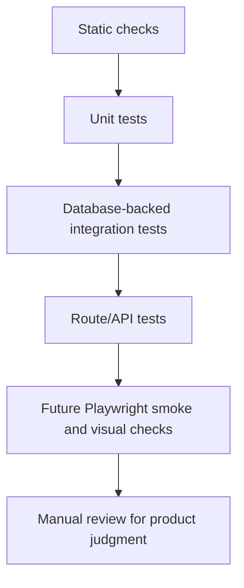

# Family Ledger Testing Strategy

## Purpose

This is the source of truth for Family Ledger testing expectations. Use it when adding behavior, changing finance calculations, changing data workflows, changing UI flows, or updating the validation harness.

## Testing Layers



## Current Commands

| Command | Purpose |
| --- | --- |
| `npm run typecheck` | TypeScript validation with `tsconfig.typecheck.json`. |
| `npm run lint` | ESLint validation with zero warnings allowed. |
| `npm run build` | Prisma client generation plus Next production build. |
| `npm run design:check` | High-signal design-system drift checks. |
| `npm run architecture:check` | Import-boundary checks for UI/server separation. |
| `npm run docs:check` | Source-doc and OpenSpec routing drift checks. |
| `npm run harness:check` | Combined Phase A harness. |
| `npm run test:unit` | Non-database Vitest tests only. |
| `npm run test` | Test runner that creates an isolated Prisma schema before Vitest. |

## Deployment Validation Sequence

For changes intended to ship through GitHub-to-Vercel deployment, testing continues past local commands:

```text
local validation
  -> commit and push to GitHub
  -> Vercel deployment completes
  -> deployed URL loads
  -> touched route or workflow passes a smoke check
  -> OpenSpec archive
```

Use the smallest relevant local command set before pushing. For process and harness changes, that is `npm run docs:check` and `npm run harness:check`. For app behavior changes, use typecheck, lint, build, and focused tests; use `npm run test` for database-backed behavior when a Prisma-compatible isolated test database URL is available.

Direct `main` deployment is acceptable for small, low-risk fixes when the maintainer intentionally accepts production auto-deploy. CI/CD, deployment, environment variable, authentication, database behavior, migrations, production-like data workflows, and large user-visible UI changes should prefer a branch or Git worktree with Vercel Preview verification before merge, then production verification after merge.

Change tasks or notes should record local checks, Vercel deployment status, the preview or production URL smoke-checked, and any skipped checks or manual-only rules.

## What Requires Tests

Add or update focused tests when changing:

- money, currency, or percentage calculations
- month-key behavior
- balance analysis filtering
- monthly refresh job behavior
- cron route authorization or result shape
- value-data rebuild behavior
- import or seed behavior
- authentication or protected route behavior
- UI workflows that can regress without type errors

## Current Test Coverage

Existing focused tests:

- `tests/balance-analysis.test.ts`
  - analysis view resolution
  - asset-only filtering
  - category-specific percentages
  - zero-total percentage behavior

- `tests/monthly-refresh.test.ts`
  - database-backed monthly refresh behavior
  - quote processing behavior
  - test data setup and cleanup paths

- `tests/monthly-refresh-route.test.ts`
  - cron route authorization
  - missing secret behavior
  - structured cron result behavior

## Database Test Rules

Rules:

- Use `npm run test` for database-backed tests that need Prisma schema isolation.
- `scripts/run-tests.mjs` builds a unique schema name and points Prisma at it.
- Do not add database-backed test files to `npm run test:unit`.
- Database-backed reset helpers must refuse to run unless `DATABASE_URL` or `TEST_DATABASE_URL` contains an isolated schema name beginning with `family_ledger_test_`.
- Tests must not reset or delete real user data.
- If a test needs cleanup, it should clean only isolated test schema data or explicitly test-tagged data.

## UI And Visual Testing

Current status:

- Playwright is not active in `package.json`.
- Screenshot and viewport checks are planned, not enforced.

Future Playwright adoption should start with:

- `/login` smoke test.
- Authenticated dashboard smoke test after deterministic auth setup exists.
- Viewport checks at 320px, 375px, 1024px, and 1440px.
- Horizontal overflow checks for core pages.
- Screenshot comparison only for stable, deterministic pages.

Rules:

- Do not add screenshot tests for pages with unstable data until fixtures are deterministic.
- Prefer smoke and overflow checks before visual snapshots.
- Screenshot comparisons should use Playwright `expect(page).toHaveScreenshot()` once stable.

## Manual Testing

Manual review remains required for:

- status not communicated by color alone
- responsive polish before Playwright adoption
- dependency justification
- shared abstraction judgment
- whether a UI still feels aligned with the design system

Manual review notes should report skipped checks and manual-only rules.

## Validation

Testing strategy itself is validated by:

- `npm run docs:check`
- `npm run harness:check`
- manual review of OpenSpec tasks and change notes

Any durable testing rule added here must also be mapped in `docs/validation-harness.md`.
